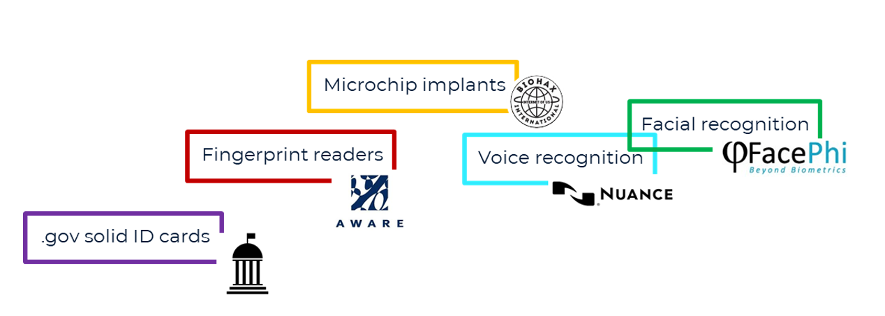
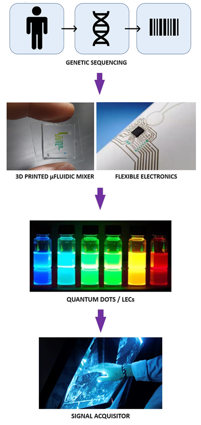
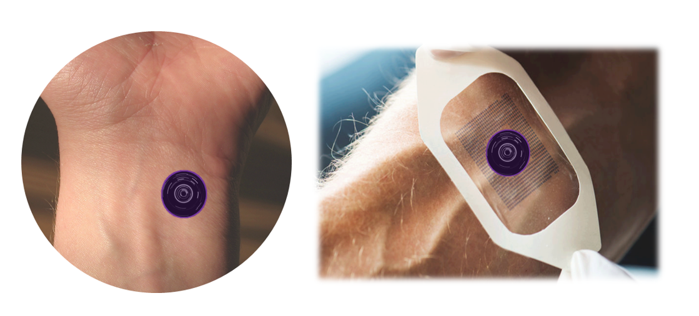

Table of Content
================
* [Affix-ID-tattoo](#Affix-ID-tattoo)
  * [Product Concept](#Product-Concept)
  * [Specifications](#Specifications)
  * [Design](#Design)
  * [Testing](#Testing)
  * [Service](#Service)
  * [Technical Functionality](#Technical-Functionality)
  * [Manufacturability](#Manufacturability)
  * [Durability](#Durability)
  * [Economic Profitability](#Economic-Profitability)
  * [Eligibility for Protection](#Eligibility-for-Protection)
  * [References](#References)

# Affix-ID-tattoo

##### **Authors:** [Adam Kozlowski](https://github.com/kozload)

### Rationale
One might observe an increased interest in smart bio-responsive devices being on the target of most pharmaceutical or, in general, medical technology companies, where physiological signals are being exploited for precise diagnosis or/and targeted therapy. Such adhesive systems, e.g. in transdermal drug delivery, resemble as important constituent in human-machine interactions, as advances in bio-inspired design of their architecture and multifunctional bioelectronics progresses. Printing technology serves here as a gate to overcome old-fashioned methodologies, obstacles and limitations, for further applications and new challenges.

### Market Survey
Fig.1 Stocktaking on the currently available technologies of physical person identification

# Product Concept
Establishment of a printable, electronic, flexible and disposable patch/tattoo as a convenient way to identify the user via genomic activation in everyday urban mobility scenarios, despite existing methods of e.g. fingerprint scanning or face recognition usage. 

# Specifications
Åffix® ID-tattoo is the smart moduled system (Fig.2), each of which has dedicated function. The innermost layer, composed of semi-absorbable, biocompatible material will attach to the user’s dermal surface, where the process of limited, temporal extraction of the DNA from the cells will take place. A priorly determined (after the user’s genetic code acquisition) biochemically established DNA-complementary reagent (ligand), located in the microfluidic mixer layer (2nd), will bind to the extracted DNA initiating signal generation within 3D printed flexible electronic circuit (3rd layer) to activate quantum dots on the outermost layer. 

Fig.2 Technological state-of the-art of Åffix® ID-tattoo

# Design
Fig.3: imaginary extrapolation on Åffix® ID-tattoo design (left) with temporal adhesion-providing superficial layer patch upon its activation (right)

# Testing
-	Biocompatibility testing: fulfilling the standards of the ISO 10993 concerning medical devices 
-	Experiments on animal- or human derived skin (grafts) ensure the biological evaluation of device’s elements, perhaps also its semi-absorbance

# Service
Liquid gel vacuum packaged product shall be delivered with drone transport via mobile app-provided user location (GPS).

# Documents
-	Consent Form: consent for the data (personal, genetic code, location) extraction and processing required from the customers 
-	Instruction of Use
-	Survey: user experience tracking and analysis with, e.g. survey methodology, might provide precious data on preferred location of the device on body region and perhaps help in the improvement of its performance

# Technical Functionality
I	Evaluation of the mechanics of the device components/materials for its functionality preservation
II	Providing adequate skin surface adhesion of the device
III	Evaluation of the device activation by individual’s unique biochemical (genomic) composition parameter
IV	Communication medium establishment for reciprocal sender/receiver information transmission
IV	Creation of basic software/application in computer interface
V	Establishment of sufficient data encryption 

# Manufacturability
The product ought to be mass-manufactured, exclusively with automated 3D printing methodology due to high-volume production and product characteristics.

# Durability
It is essential to perform comparison of durability of printed flexible materials used in everyday routine.

# Economic Profitability	
The costs of manufacturing are still under investigation, since the choice of the dedicated materials and methods is not clear yet. An assumption has been made on the possible price of the 4x individualized patches to be at €29.

# Eligibility for Protection
Specific Intellectual Property applications shall be made – patenting, design right, trademark.

# References

1. Zixian Bao, Minghong Gao, Yue Sun, Rui Nian, Mo Xian, The recent progress of tissue adhesives in design strategies, adhesive mechanism and applications, Materials Science and Engineering, 2020
2. Baik S, Lee HJ, Kim DW, Kim JW, Lee Y, Pang C. Bioinspired Adhesive Architectures: From Skin Patch to Integrated Bioelectronics. Adv Mater., 2019 
3. Song K, Li G, Zu X, Du Z, Liu L, Hu Z. The Fabrication and Application Mechanism of Microfluidic Systems for High Throughput Biomedical Screening: A Review. Micromachines (Basel). 2020 Mar 11
4. Tuhkala T., Tuomaala T., Määttä H. (eds.), Practical guide to screen printing in printed electronics, ePOOKI 48/2019 – RDI publications of Oulu University of Applied Sciences
5. You Yu, Hnin Yin Yin Nyein, Wei Gao, Ali Javey, Flexible Electrochemical Bioelectronics: The Rise of In Situ Bioanalysis, Advanced Materials, 2019
6. Yu J, Zhang Y, Kahkoska AR, Gu Z. Bioresponsive transcutaneous patches. Curr Opin Biotechnol., 2017

